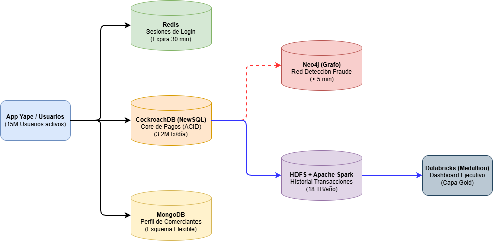

**UNIVERSIDAD AUTÓNOMA DEL PERÚ**
**FACULTAD DE INGENIERÍA Y ARQUITECTURA**
**ESCUELA PROFESIONAL DE INGENIERÍA DE SISTEMAS COMPUTACIONALES**

# EVALUACIÓN PARCIAL — BIG DATA
## Código: DD283 | Ciclo VIII | Semestre 2026-1

---

| **CÓDIGO DEL ESTUDIANTE:** | 2231896838 | **NÚMERO DE CLASE:** | *4* |
|---|---|---|---|
| **APELLIDOS Y NOMBRES:** | Carbajal Campomanes, Armando Jheferson | **FECHA ENTREGA:** | 27/06/2026 |
| **DOCENTE:** | **Mg. Rubén Quispe Llacctarimay** | **Modalidad:** | **Implementación + Video** |

---
#### Link de Video: https://drive.google.com/file/d/1rqCYVaNxoA5EAbGr4lcZ3xMLZo9O-Fub/view?usp=drive_link 
#### Link de Repositorio Github: https://github.com/acarbajalCode/yape-carbajal-armando.git 
---

## PARTE A — DISEÑO Y ARQUITECTURA
### Arquitectura Draw.io: —

-----

### PREGUNTA 1.1 — Arquitectura Big Data de Yape

| Componente del sistema | Tecnología elegida | Tipo BD/Herramienta | Por qué esta tecnología para Yape (2 líneas) |
|------------------------|-------------------|--------------------|--------------------------------------------|
| Core de pagos (3.2M transacciones/día, no puede perder dinero) | CockroachDB | NewSQL / Relacional Distribuida | Garantiza que nunca cuadre mal el dinero (consistencia fuerte) y, al mismo tiempo, permite manejar millones de usuarios sumando servidores económicos sin saturarse. |
| Sesiones de login activo (15M usuarios, expira en 30 min) | Redis | NoSQL / Clave-Valor (En memoria) | Trabaja directo en la memoria RAM, lo que permite verificar accesos al instante y borrar automáticamente las sesiones expiradas sin darle carga a la base de datos principal. |
| Perfil del comerciante (bodega, restaurante, taxi) | MongoDB | NoSQL / Documental | Su estructura flexible permite guardar información muy variada sin crear espacios vacíos o nulos, ya que un taxista no necesita los mismos datos que un restaurante. |
| Historial de transacciones para análisis (18 TB/año) | Hadoop HDFS + Apache Spark | Sistema de Archivos Distribuido + Procesamiento | Permite almacenar los 18 TB anuales de forma económica (HDFS) y procesarlos masivamente (Spark) para sacar reportes sin poner lento el sistema de pagos en vivo. |
| Red de detección de fraude (ciclo A→B→C→A en < 5 min) | Neo4j | NoSQL / Grafo | Está diseñada específicamente para encontrar relaciones de forma natural y ultra rápida (quién le envió dinero a quién), clave para bloquear redes de fraude al instante. |
| Dashboard ejecutivo (top 10 distritos, actualización diaria) | Databricks (Medallion Architecture) | Plataforma Lakehouse | Centraliza, limpia y prepara los datos en capas ordenadas, entregando indicadores diarios totalmente confiables y listos para la toma de decisiones gerenciales. |

---

### PREGUNTA 1.2 — Teorema CAP

| Componente | Combinación CAP | Propiedad sacrificada | ¿Por qué ese sacrificio es correcto o incorrecto para este caso? |
|------------|----------------|----------------------|----------------------------------------------------------------|
| Core de pagos (débito/crédito de saldos) | CP (Consistencia + Tolerancia a Particiones) | Disponibilidad (A) | **Es correcto.** En finanzas, es preferible que la app muestre "Yape temporalmente fuera de servicio" (sacrificar disponibilidad) antes que procesar un pago duplicado o perder dinero por un fallo de red. |
| Historial "mis últimas 50 transacciones" | AP (Disponibilidad + Tolerancia a Particiones) | Consistencia fuerte (C) | **Es correcto.** Si hay una caída en los servidores, es aceptable que el usuario vea su historial desactualizado por unos minutos (sacrificar consistencia), siempre y cuando la app siga funcionando y no se congele. |

---

### PREGUNTA 1.3 — NewSQL

**a) ¿Qué limitación de Oracle resuelve CockroachDB al escalar de 15M a 50M usuarios?**
La limitación del escalamiento vertical. Oracle tradicional requiere mejorar el hardware de un único servidor central (más CPU, más RAM), lo cual llega a un límite físico y de costos altísimo. CockroachDB resuelve esto escalando horizontalmente (agregando más servidores comunes a la red) para distribuir la carga de esos 50M de usuarios fácilmente.

**b) ¿Por qué MongoDB NO puede reemplazar a Oracle para el procesamiento de pagos aunque también escala horizontalmente?**
Porque MongoDB prioriza la flexibilidad y la velocidad, sacrificando el cumplimiento estricto de las propiedades transaccionales complejas (ACID) entre múltiples documentos. En un core de pagos, si se descuenta saldo a "A", debe sumar a "B" obligatoriamente al mismo tiempo; si algo falla en el medio, MongoDB podría generar un descuadre financiero.

**c) ¿Qué mecanismo técnico usa CockroachDB para mantener ACID en múltiples nodos distribuidos?**
Utiliza el algoritmo de consenso **Raft**.

-------------

## PARTE D — DOCKER DESKTOP

### PASO 3 — Diferencia entre Docker y Atlas

**a) ¿Cuándo usarías MongoDB en Docker en lugar de MongoDB Atlas para el equipo de Yape?**
Usaría Docker para el entorno de desarrollo y pruebas locales. Permite a los desarrolladores levantar una base de datos limpia y aislada en segundos, trabajar sin conexión a internet, evitar costos de nube y destruir el entorno fácilmente al terminar las pruebas de integración continua (CI/CD).

**b) ¿Qué ventaja tiene Atlas M0 sobre el contenedor Docker para el contexto universitario?**
La principal ventaja es la accesibilidad en la nube. Atlas M0 está siempre disponible, no consume recursos (RAM/CPU) de la computadora del estudiante y permite acceder a los mismos datos desde cualquier lugar (como Google Colab o diferentes PCs) sin tener que instalar Docker localmente.

**c) ¿Qué sucede con los datos del contenedor Docker si ejecutas `docker stop yape-mongo-local` y luego `docker rm yape-mongo-local`? ¿Y con los datos de Atlas?**
Al ejecutar `docker rm`, el contenedor se elimina y **todos los datos locales se pierden de forma permanente** (a menos que se hayan configurado volúmenes de persistencia). Por el contrario, los datos en MongoDB Atlas permanecen intactos y seguros en la nube, ya que son independientes de las acciones ejecutadas en el entorno local.